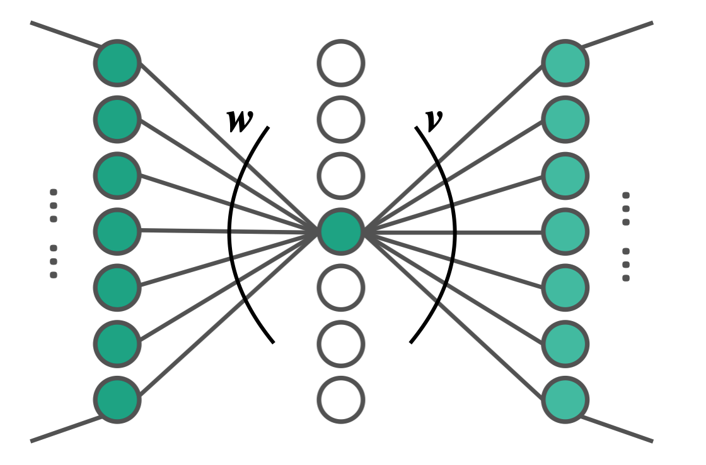
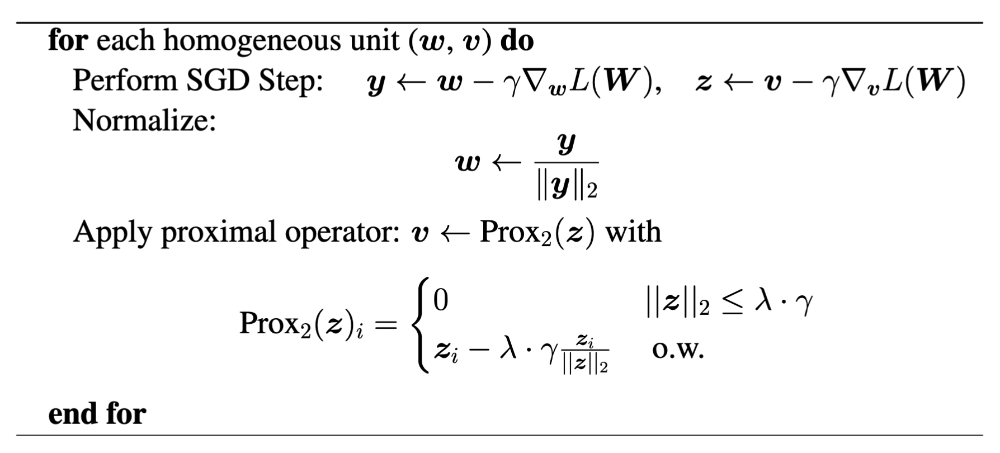

# PathProx: A Proximal Gradient Algorithm for Weight Decay Regularized Deep Neural Networks
Liu Yang, Jifan Zhang, Joseph Shenouda, Dimitris Papailiopoulos, Kangwook Lee, Robert D. Nowak

You can find the paper in [arxiv](https://arxiv.org/abs/2210.03069).

## Overview
This codebase contains the implementation for the **PathProx**, the proximal gradient algorithm for the 
$|| \boldsymbol{w} ||_2 ||\boldsymbol{v}||_2$ norm, 
where $\boldsymbol{w}$ and $\boldsymbol{v}$ are the input and output vector for a homogeneous unit (e.g. ReLU neuron).
<p align="center" width="100%">
    
</p>

Training with this regularization term is effectively equivalent as training with the weight decay objective for neural nets with homogeneous units.
But with **PathProx**, the weight decay objective is minimized at a faster rate, and the sparse solution to weight decay 
is preferred.
In the repo, we include the experiments for MNIST subset, MNIST on the multi-layer perceptron (MLP), 
and CIFAR-10 on VGG19 network.

## Setup
Please install the environment through
```shell
conda env create -f environment.yml
```

## Running Experiments
Please run `bash exec/script.sh` with different config files:
- mnist subset + mlp factorized
```shell
config_name='./configs/mnist_subset_mlp.yml'
```
- mnist subset + mlp
```shell
config_name='./configs/mnist_mlp.yml'
```
- cifar10 + vgg19
```shell
config_name='./configs/cifar_vgg.yml'
```
You can find the plot script in `plot_figure.ipynb`.

## Implementation Details
### Model Details
To plug in any model architecture, we need to specify the `grouped_layers` and `other_layers` for the models:
- `grouped_layers` are of form `[[input_layer, output_layer], ...]`, where we will perform the proximal gradient update on.
- `other_layers` contain the other layers that we will use normal weight decay (with batched SGD) to regularize.
Please see the example of model definition under `models/`.

### Proximal Gradient Update
The code for **PathProx** algorithm is presented in `regularize_func.py`.
For each grouped layer in the model's `grouped_layers`, we apply normalization of $\boldsymbol{w}$, and proximal gradient update for $\boldsymbol{v}$.
A simplifed version of the algorithm is shown below. Please refer to the paper for the detailed algorithm.
<p align="center" width="100%">
    
</p>

### Layerwise Balance and Regularizing Bias
To ensure function equivalence after applying the layerwise balance, we will not regularize bias. 
Therefore, in the argument, if we set `regularize_bias=True`, we will disable layerwise balance during training.
By default, we use `regularize_bias=False` when reporting the result in the paper.
